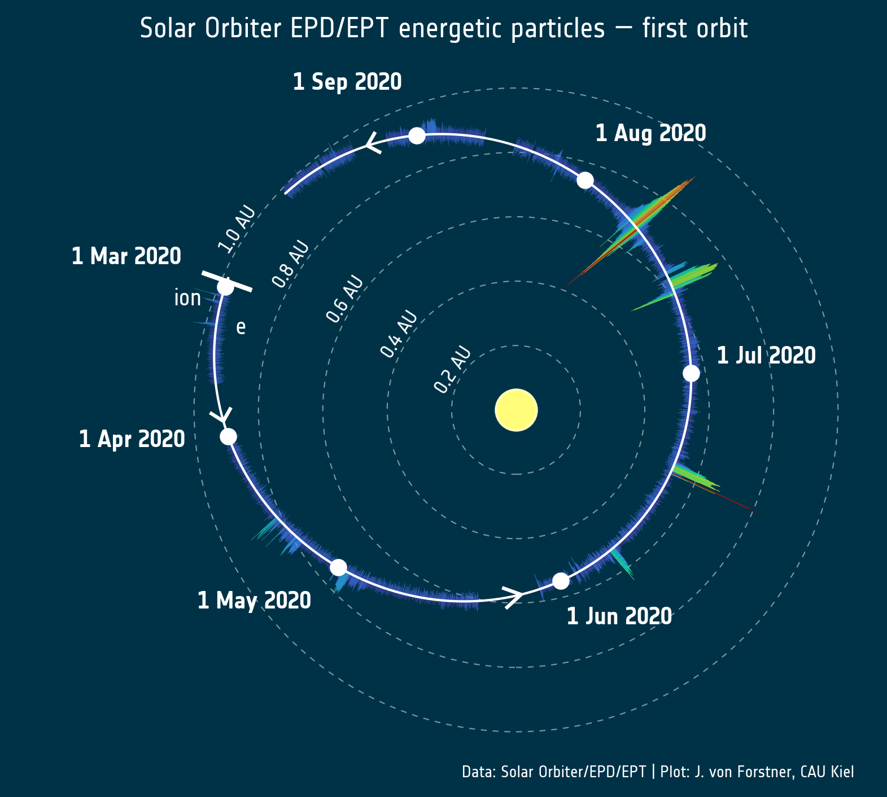
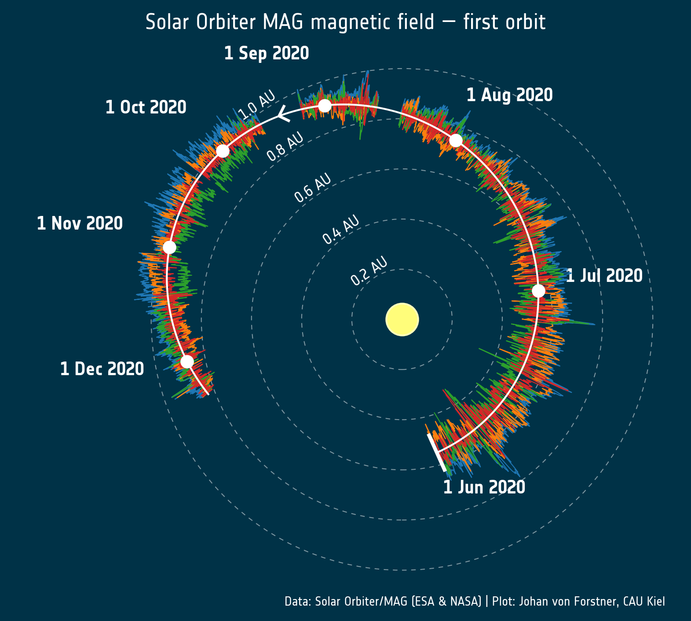

SolO orbit data plots
=====================

This repository contains scripts to create the Solar Orbiter orbit data plots, prepared by
Johan von Forstner and Alexander Kollhoff.

The plotting style was inspired by a plot from [McComas et al., 2019](https://www.nature.com/articles/s41586-019-1811-1)
(Figure 1) for Parker Solar Probe IS𐍈IS.

Plots can be produced in a plain matplotlib style (`'plain'`) or in a style that emulates
[the ESA press release version of this plot](https://www.esa.int/ESA_Multimedia/Images/2020/12/An_orbit_s_worth_of_particle_data)
(`'esa'`). For the latter, the `NotesEsa` font needs to be installed, which can be found in the `fonts` directory.

Requirements
------------

- Python >= 3.7
- [SolO Loader](https://gitlab.physik.uni-kiel.de/solo/solo_loader) for loading the Solar Orbiter data
- [ET SPICE](https://gitlab.physik.uni-kiel.de/ET/et_spice) for accessing the SPICE kernels to get the orbit data
- [matplotlib](https://matplotlib.org/) for plotting